# 🏍️ RideButler 騎士管家 — 二手重機交易平台 AI 客服 Harness

> **2026 Deep Reinforcement Learning — Homework 4（AI Harness Systems Design）**
>
> 以大型語言模型（OpenAI `gpt-4.1-mini`）作為**系統控制器**，透過 **function calling** 串接平台資料與工具，端到端處理買家的多步驟客服請求。本文件重點在 **system design 思維** ——*AI 如何進行 tool use 與 decision-making* ——而非模型訓練或演算法推導。

---

## 1. 問題定義與應用背景

二手重機交易平台的買家有大量**重複、跨步驟、需即時查資料決策**的諮詢：找符合預算的車、比較車款規格、查交易／看車進度、處理退款糾紛。傳統 FAQ 或關鍵字搜尋接不住像「**30 萬內想要 Yamaha 跑車，再幫我約看車**」這種一句話包含多意圖、需要查資料、又需要連續動作的請求。

RideButler 把 LLM 當作**控制器**而非答題機：它讀懂請求、**自行決定該呼叫哪個工具、帶什麼參數**，把工具回傳的結構化資料組成回覆，無法安全處理時轉接真人。目標使用者為平台買家，典型任務分四類：**找車推薦 / 規格比較 / 交易訂單 / 售後轉真人**。

下圖是實際操作中的介面 —— 左為對話、中為 LLM 決策後**內嵌渲染的車款卡片**、右為**即時串流的決策管線（推理管線）**，逐步顯示每一個 decision-making 與 tool-use 步驟及其耗時、token 數：

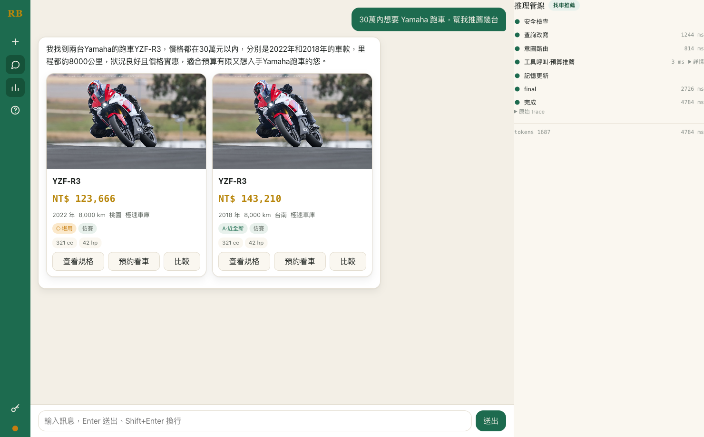

> 右側管線完整還原了一次請求的內部流程：`安全檢查 → 查詢改寫 → 意圖路由（找車推薦）→ 工具呼叫·預算推薦 → 記憶更新 → 完成`，每階段標注真實耗時，底部累計該輪 token。這正是本系統的核心 —— 把 AI 的決策過程變成可觀察、可稽核的明確步驟。

---

## 2. AI Harness 系統架構與流程

採 **Approach B：Router + 工具迴圈（混合式 orchestration）**。相較單一 ReAct 迴圈，它同時展示「**意圖決策**（router）」與「**工具使用**（function-calling 迴圈）」；又不像完整 graph 狀態機那樣過度工程。一筆請求依序流經四個管線階段，並由 Memory 與 Governance 兩個**橫切**元件貫穿：

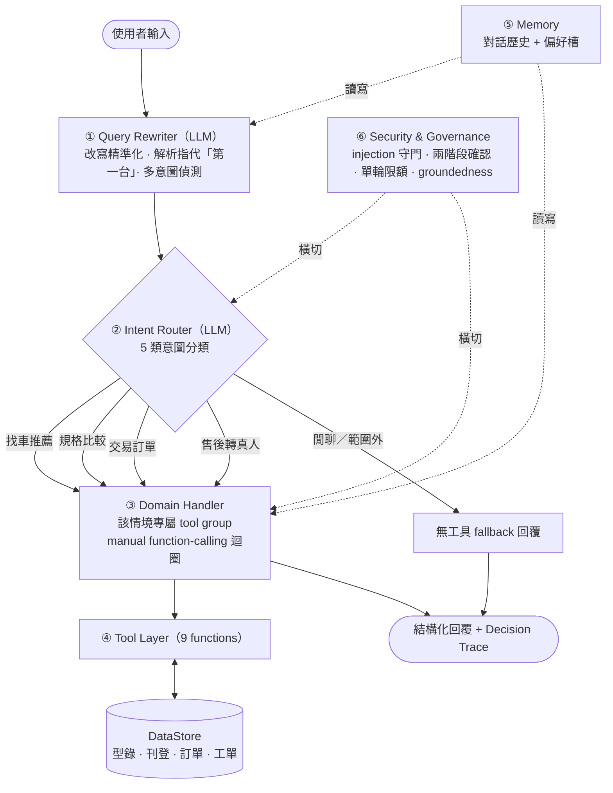

本設計刻意對齊標準 **AI Harness 六大元件**：

| 標準元件 | 本系統實作 |
|---|---|
| **Prompt** | 分層 system prompt（rewriter / router / 各情境 handler / fallback），集中於 `prompts.py` |
| **Orchestration** | `Orchestrator` 串接四階段 + `Intent Router` 做意圖決策 |
| **核心迴圈 Context → Observe → Reason → Act** | Rewriter＋Memory 組裝上下文 → Router 觀察分類 → Handler 推理選工具 → 執行工具／回覆 |
| **Tools & Skills** | 9 個 function，分 4 領域 tool group；找車推薦含混合檢索工具 `semantic_search` |
| **Memory** | session-keyed 對話歷史 + 偏好槽（budget / brand / usage / viewed_listings / pending_intent） |
| **Security & Governance** | `governance.py` + orchestrator 治理鉤子，橫切所有階段 |

### AI 如何進行 tool use 與 decision-making：manual function-calling 迴圈

系統**關閉 SDK 自動代呼**、改用手動迴圈，以便逐步攔截、產生 decision trace、執行單輪工具上限。一次「模型決策 → 執行 → 回填 → 續推理」的往返如下 ——**決策由模型做（要不要呼叫工具、呼叫哪個、帶什麼參數），執行與守門由 harness 做**：

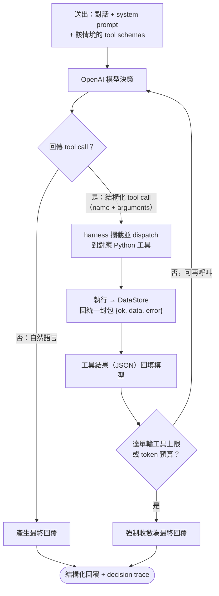

關鍵設計：
- **模型回的是「結構化 tool call」而非自然語言** —— harness 攔截 `name`／`arguments`，自己 dispatch、自己執行、把 JSON 結果餵回，模型可在**單輪內多次往返**（先 `recommend` 再追問細節）。
- **終止條件明確**：模型不再 emit tool call、或達單輪工具上限／token 預算（`TurnBudget`），避免迴圈失控。
- **每一步都寫進 decision trace**（`raw_input / rewritten_query / router_label / 工具步驟 / tokens`），即右側管線面板即時顯示的內容，同時作為 audit log。
- **抽象層**：所有 LLM／embedding／rerank 存取走 `LLM`／`Embedder`／`Reranker` Protocol，測試注入決定性的 `Fake*` → 全離線、零成本、可重現，單元測試不打真實 API。

**完整推理管線（單次請求的決策軌跡）**——下圖是一次語意找車請求的完整管線：從 `安全檢查 → 查詢改寫 → 意圖路由` 到 `工具呼叫·語意檢索`（底下嵌著混合檢索四子步：關鍵字→向量→RRF→重排序），再到 `記憶更新 → 完成`。每階段標注真實耗時、底部累計該輪 token；每個工具／子步皆可展開「詳情」看實際輸入輸出，並另存一份「原始 trace」JSON 供稽核。這就是 AI 把「黑箱推理」攤開成可觀察、可審計步驟的方式。

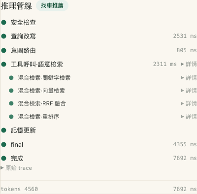

管線每一步的「詳情」都可展開，看到該步驟的**實際輸入輸出**（點開下方摺疊區）：

<b>展開每一步的「詳情」JSON</b> —— 混合檢索四子步排名、<code>semantic_search</code> 工具 I/O、完整原始 trace（點我展開）

 

**① 混合檢索四子步的逐段排名**（BM25 → 向量 → RRF 融合 → 重排序，每段列出 top-k 與分數）。可看到 BM25 與向量都把 `CB300R` 排第一，RRF 融合後維持；重排序則依「新手好上手」語境把 `ADV350` 拉到第一 —— 這就是 rerank 在固定候選池內**重排序**的決策：

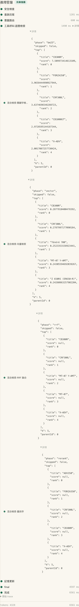

**② `semantic_search` 工具的結構化 I/O** —— 統一封包 `{name, ok, error, result_summary[...]}`，每筆命中含 `listing_id`／`match_snippet`／`retrieval_rank`：

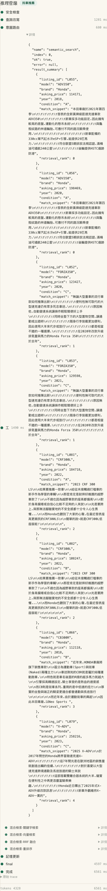

**③ 完整原始 trace（audit JSON）** —— `raw_input`／`rewritten_query`／`router_label`／逐步驟工具結果／`tokens`，整輪可稽核：

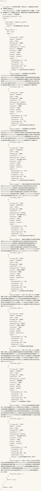

---

## 3. 情境與 Tools 設計

**情境隔離**是這層的核心決策：Router 把請求分到某一情境後，該情境的 Handler **只看得到自己這組工具的 schema**，從源頭降低「售後情境卻誤呼叫找車工具」這類誤用。9 個工具分屬 4 個 tool group，第 5 類（閒聊／範圍外）刻意**無工具**、走 fallback：

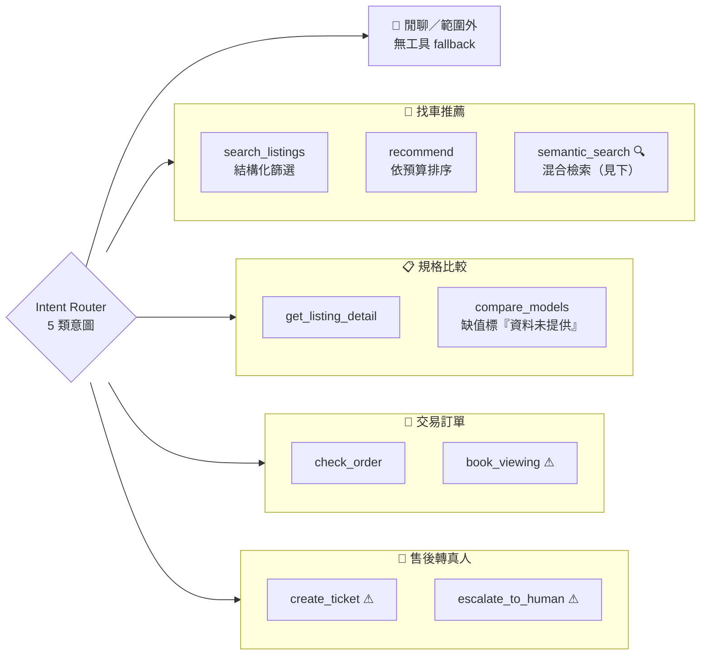

> **⚠ ＝ 兩階段確認閘**（狀態變更工具）：`book_viewing`／`create_ticket`／`escalate_to_human` 會先回確認摘要、**暫停**，等使用者「確認」後才真正執行，避免模型誤觸發。
> **🔍 ＝ 混合檢索工具** `semantic_search`，每個工具一律回傳統一封包 `{"ok", "data", "error"}`。

| 領域 | 工具 | 簽章 | 功能 |
|---|---|---|---|
| 找車推薦 | `search_listings` | `(brand_pref?, max_price?, year_from?, usage?)` | 依條件篩選在售刊登（join 型錄 usage/specs） |
| | `recommend` | `(budget, usage?, brand_pref?)` | 依預算／車種由低到高排序推薦 |
| | `semantic_search` | `(query, budget?, usage?)` | 自然語言語意檢索，回在售刊登 |
| 規格比較 | `get_listing_detail` | `(listing_id)` | 單一刊登完整規格＋車況 |
| | `compare_models` | `(model_a, model_b)` | 並排比較；缺值顯示「資料未提供」 |
| 交易訂單 | `check_order` | `(order_id? / buyer?)` | 查交易／出貨／退款狀態 |
| | `book_viewing` ⚠ | `(listing_id, datetime, contact)` | 建立預約看車（**狀態變更**） |
| 售後轉真人 | `create_ticket` ⚠ | `(category, description)` | 建立客訴／退款工單（**狀態變更**） |
| | `escalate_to_human` ⚠ | `(reason)` | 轉接真人客服（**狀態變更**） |

### 各情境實況（即時截圖）

下列截圖皆取自真實操作（demo 模式）。每張右側「推理管線」即時顯示該情境的 router 判定與 tool use，是觀察 AI decision-making 的最佳窗口。

**① 找車推薦（語意檢索）** — 模糊情境查詢（「新手通勤省油好停、偶爾跑山」）觸發 `semantic_search`，管線逐步展開混合檢索四子步（關鍵字→向量→RRF→重排序），中央渲染命中車卡與「語意命中」片段。（§1 招牌截圖則是帶明確品牌／預算時走結構化 `recommend` 的另一條找車路徑。）

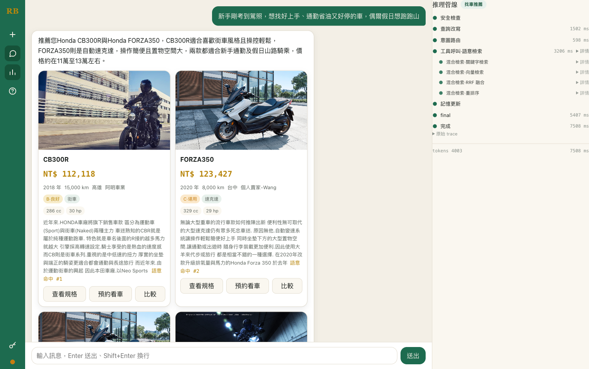

**② 規格比較** — 路由＝規格比較，呼叫 `get_listing_detail` 取回單一刊登的完整規格與車況，據實作答（價格／里程／排氣量／馬力皆來自工具回傳）。

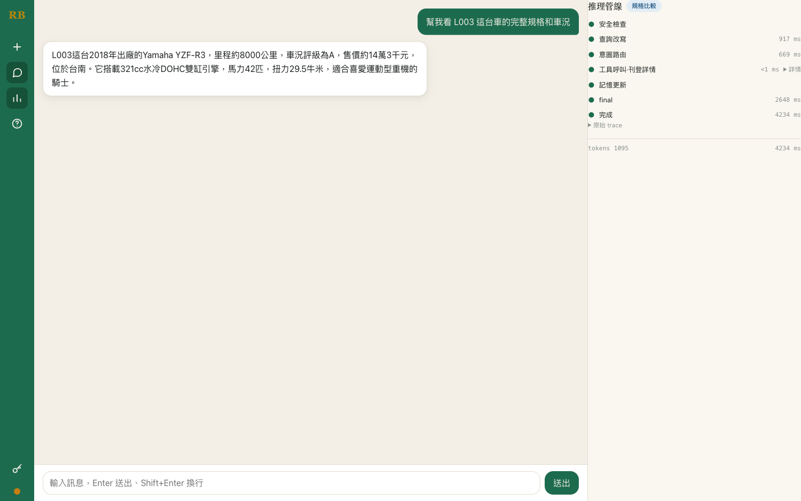

**③ 交易訂單** — 路由＝交易訂單，呼叫 `check_order` 查回訂單 O001 的即時狀態（退款中），不捏造查無的訂單。

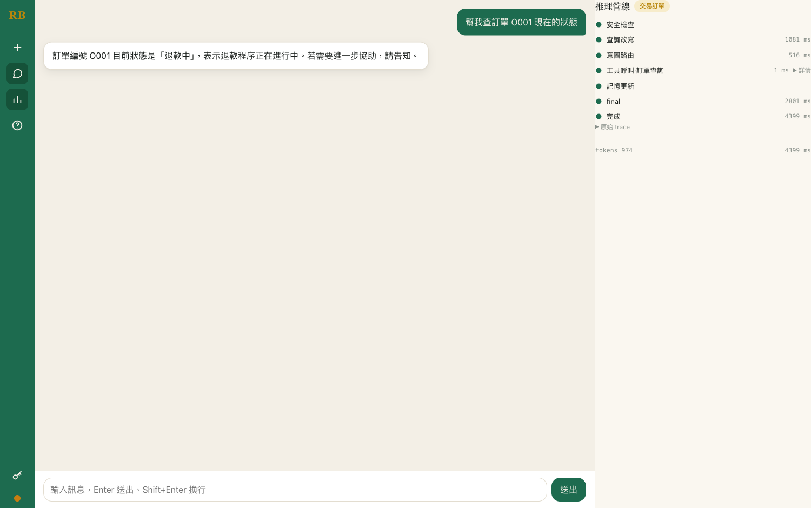

**④ 售後轉真人（兩階段確認閘）** — 路由＝售後轉真人，模型擬呼叫狀態變更工具 `escalate_to_human`，管線**停在 ◐ 需要確認**、聊天區跳出確認摘要與「確認／取消」鈕，使用者同意後才真正執行。這就是不可逆動作的安全閘。

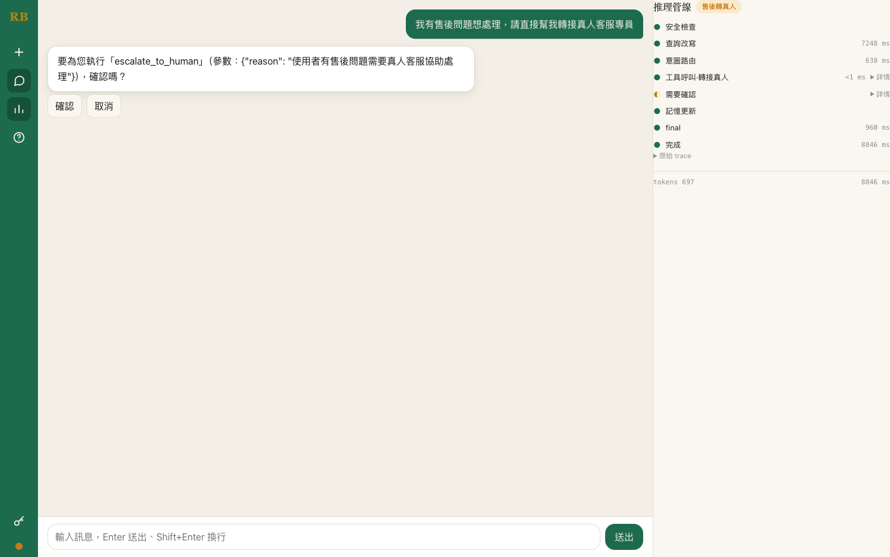

**⑤ 異常／範圍外** — 要求「用 Python 寫一段快速排序」被路由為**閒聊範圍外**，管線走「範圍外回應」、**不呼叫任何工具**，禮貌婉拒並把使用者導回重機客服範疇，守住服務邊界。

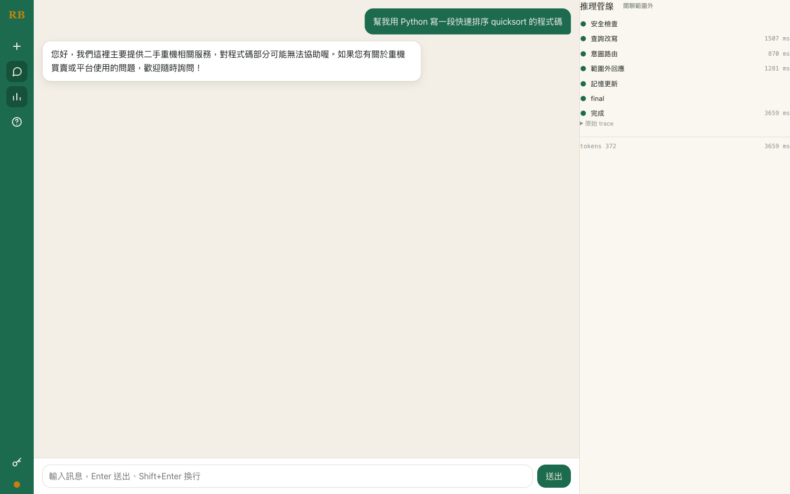

### 混合檢索階段（`semantic_search` 背後）

結構化篩選接不住「**新手通勤想省油好停、偶爾跑山**」這類無明確品牌／車種／價格條件的查詢。為此 `semantic_search` 背後接一條獨立的三段混合檢索管線，對 **33 款型錄描述**檢索後展開為在售刊登：

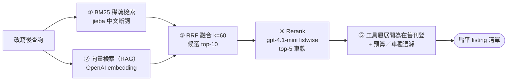

- **決策層次清楚**：BM25 + 向量管「**召回**」（找回詞面漏掉的相關車款），Rerank 管「**排序精度**」（在固定候選池內重排到前面）。逐段貢獻量化見 §5 ablation。
- **groundedness 沿用**：刻意回**扁平 listing 清單**（與 `search_listings` 同形狀），既有的價格忠實度檢查與「第一台」序數指代**零改動即生效**。
- **優雅降級**：embedding 失敗 → 退回純 BM25；rerank 不符 id 契約 → 退回 RRF 序。

---

## 4. Agent Workflow 流程說明

跨步驟任務最能展現 decision-making。以招牌請求「**30 萬內想要 Yamaha 跑車，再幫我約看車**」的四輪對話為例，看 Router、Memory、確認閘如何協同：

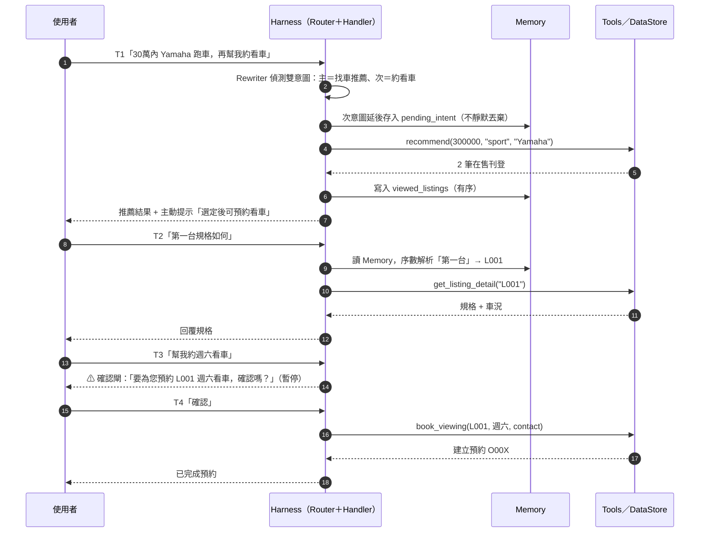

這條流程示範了四個關鍵 decision-making 機制：

1. **多意圖策略**：單輪只處理主意圖，次意圖存入 `pending_intent` 延後，**不靜默丟棄**。
2. **序數指代解析**：「第一台」靠 Memory 的 `viewed_listings`（有序）解析成具體 `listing_id`，跨輪維持上下文。
3. **兩階段確認閘**：狀態變更動作（約看車）先回摘要、暫停，使用者同意才執行 —— 把「不可逆動作」的決定權交回使用者。
4. **decision trace**：每一步輸出結構化軌跡（即介面右側管線），既是即時 UX、也是稽核紀錄。

**實際多輪對話**（同一 session 連續三輪，上圖機制的真實演示）——`找車推薦` 先推薦兩台 YZF-R3；使用者接著說「預約看**第一台**」，序數經 Memory 解析為具體刊登 `L004`、**跨情境**呼叫 `book_viewing` 並停在確認閘；使用者點「確認」後才真正建立預約。記憶、序數指代、跨情境、兩階段確認閘一次到位：

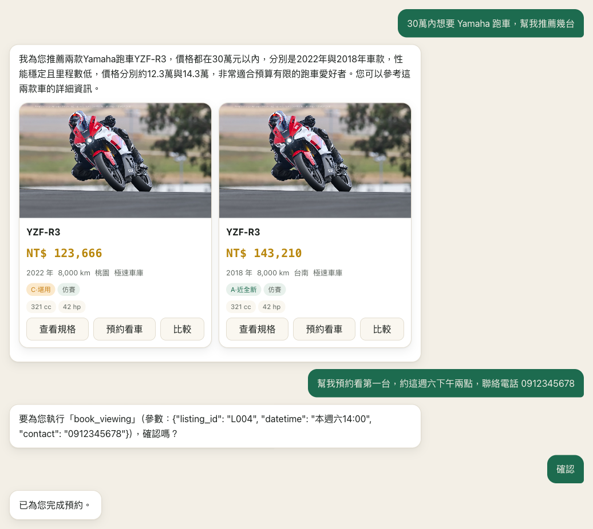

---

## 5. Evaluation 方法

評估走**雙軌**：

- **離線（主驗證、可重現）**：所有 LLM／embedding／rerank 經 Protocol 注入決定性 `FakeLLM`／`FakeEmbedder`／`FakeReranker` → **單元測試全綠、零 API 成本、可重現**，覆蓋 router／工具迴圈／兩階段確認／groundedness 護欄／governance／混合檢索三段管線。
- **真實端到端**：自建**標註測試集**，以真實 OpenAI `gpt-4.1-mini` 跑完整管線，對每個指標輸出數值與 **PASS／FAIL（對門檻）**。

評估原則是**誠實揭露、不灌水** ——「不灌水」定義為 *testset 與計分器凍結不動、未達門檻就如實標 FAIL*，**不是**把數字調漂亮。

### 5.1 主測試集（27 題，router / task / groundedness）

| 指標 | 衡量方式 | 數值 | 門檻 | 判定 |
|---|---|---|---|---|
| **router_accuracy** | 5 類意圖分類正確率 | **0.889**（24/27） | ≥ 0.90 | ✗（差一題） |
| **task_success** | 呼叫了預期工具且參數正確 **且** 答案含正確事實 | **0.593** | ≥ 0.85 | ✗ |
| **groundedness 違規率** | 回覆中的價格是否皆源自工具回傳（規則比對為主） | **0.037**（≈1/27） | ＝ 0 | ✗（大幅改善） |
| **multiturn 鏈成功率** | 真兩輪量測：主工具(turn-1)＋次工具(turn-2) 是否都觸發 | **0.50**（2/4） | — | — |
| avg_latency | 平均每題延遲 | 3.6 s | — | — |
| avg_tokens | 每輪累加所有 OpenAI 呼叫 token | 1,521 | — | — |
| **PASS** | | **false** | | |

> **誠實分析**：主要缺口在 `task_success` —— `gpt-4.1-mini` 在我們的 prompt 下**有時直接作答而未 emit 預期的 function call**（售後情境最明顯），這反映**該模型的工具呼叫傾向**，而非 harness 接線缺陷（接線已由離線單元測試驗證全綠）。`groundedness 違規率`由早期基線 **0.222 大幅降到 0.037**：原本被 flag 的數字幾乎全是計分器把模型**正確引用的里程**誤判（計分器只白名單價格）；精簡找車 prompt（卡片已呈現規格，文字不逐台重述里程、但保留價格可述）後偽陽性自然消失。**testset 與計分器一字未改**（凍結守門全綠），屬同一量尺下的真實改善。

### 5.2 混合檢索 ablation（BM25 → ＋向量 → ＋Rerank）

對 16 題自然語言語意查詢量測三段管線的逐段貢獻（真實 `text-embedding-3-small` + `gpt-4.1-mini`，模型層車款檢索）：

| 配置 | recall@1 | recall@5 | MRR@10 | nDCG@5 |
|---|---|---|---|---|
| BM25 only | 0.375 | 0.625 | 0.549 | 0.501 |
| ＋向量（RRF 融合） | 0.375 | 0.688 | 0.557 | 0.541 |
| ＋Rerank（完整） | **0.688** | **0.812** | **0.760** | **0.729** |

> **逐段貢獻清楚對應設計分工**：向量檢索把候選池天花板（recall@10）由 0.688 拉到 0.812 —— 貢獻在**召回**；Rerank 把 recall@1 由 0.375 躍升到 0.688、MRR 0.557→0.760 —— 貢獻在**排序精度**（候選池不變，只重排）。16 題為**方向性示意基準、非統計顯著**；含非決定性的 rerank 跑 3 次取均值（本批離散度為 0）。

### 5.3 Robustness Eval（40 題：使用情境 / 邊緣 / 異常 / 安全）

獨立資料集 40 題（四類各 10），端到端跑真實 `gpt-4.1-mini`，每題只評估其宣告的檢查、pass ＝ 全過：

| 類別 | n | pass_rate |
|---|---|---|
| usage 使用情境 | 10 | 0.50 |
| edge 邊緣 | 10 | 0.80 |
| exception 異常 | 10 | 0.70 |
| security 安全 | 10 | **1.00** |
| **總體** | **40** | **0.725** |

> **結構性穩健**：路由 100%、零崩潰（亂碼／超長／emoji／矛盾輸入皆未 crash）、查無資料誠實回報（未捏造任何 L###／O###）、兩階段確認閘在「不用問直接約」的繞過嘗試下仍守住、prompt-injection 由輸入守門＋模型拒絕擋下（**安全 10/10**）。
> **誠實揭露的計分器侷限**：`grounded` 缺口幾乎全是計分器偽陽性（把模型正確引用的**里程**誤判，因計分器只白名單價格），非模型幻覺。
> **同 prompt 精簡後重跑**（testset／計分器仍一字未改）：里程不再進入回覆 prose → 偽陽性消失，**總 pass 0.725 → 0.925、`grounded` 檢查 25/38 → 37/38、exception 0.70 → 1.00**。這是回覆更乾淨帶來的真實提升，非放寬計分。

---

RideButler · 2026 Deep Reinforcement Learning HW4 · AI Harness Systems Design
